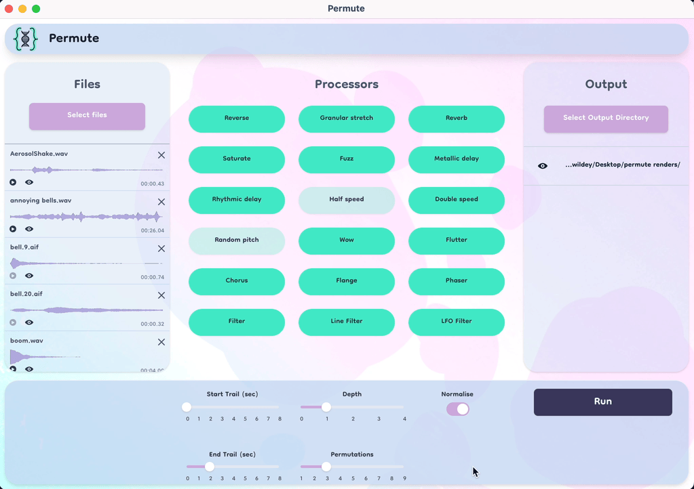

# Permute
[Website](https://jonnywildey.github.io/permute/)

Permute is a library and UI for quickly generating large numbers of variations of audio files.

There is a small library of signal processors, terminal tools and UIs for randomly chaining processors together.

## Architecture

_permute-core_ is the rust audio processing library

_audio-info_ generates waveform SVGs

_permute-node_ is the node bindings for permute-core and audio-info

_permute_app_ is the electron app

## How to install UI

Only works on MacOS. [Download package](https://github.com/jonnywildey/permute/releases)

## How to install terminal

Clone the repo, build in Rust. You may need to install `libsndfile`

# libsndfile

- Install libsndfile binaries https://github.com/bastibe/libsndfile-binaries
- Run autogen.sh
- mv the newly created libsndfile/src/.libs to ./libsndfile-src

# Steps to run electron app with updated core

- run cargo build in core
- run package.json build-update in node
- run release/app/package.json install  postinstall
- Potentially update the release/app to  "permute-node": "../../../permute-node/permute-node-0.2.0.tgz"

## Quirks

- Multiple instances of granualar stretching and pitch shifting can create very large audio files
- Chaining processes can quickly dramatically affect volume levels. We recommend enabling normalise
- Aifs cannot be played in electron apps. 
