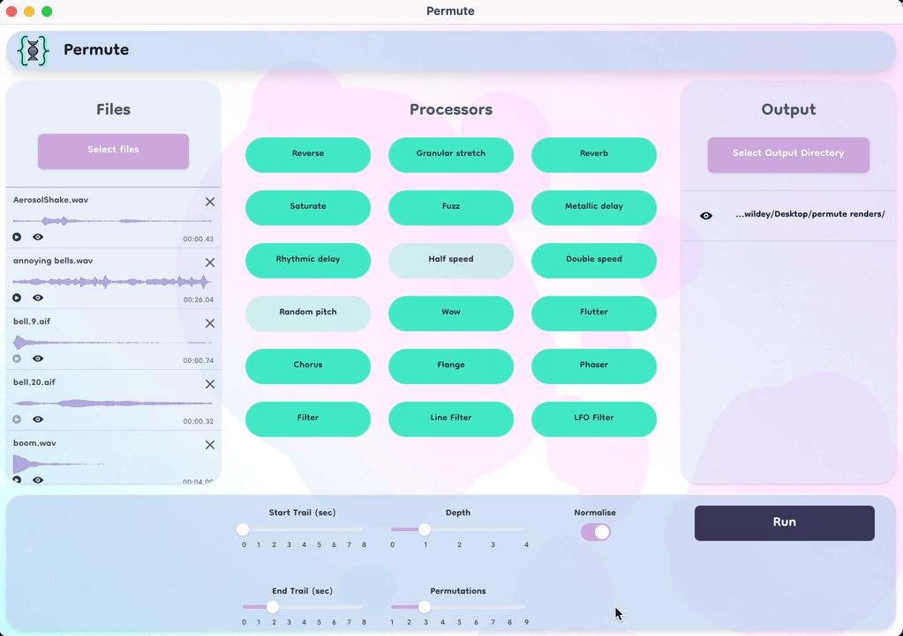

# Permute
[Website](https://jonnywildey.github.io/permute/)

Permute is a library and UI for quickly generating large numbers of variations of audio files.

There is a small library of signal processors, terminal tools and a UI for randomly chaining processors together.




## Architecture

_permute-core_ is the Rust audio processing library

_audio-info_ generates waveform SVGs

_permute-tauri_ is the desktop UI (Tauri + React)


## How to install UI

Only works on macOS. [Download package](https://github.com/jonnywildey/permute/releases)

## How to install terminal

Clone the repo, build in Rust. You may need to install `libsndfile`.

## How to run the UI (development)

```bash
cd permute-tauri
npm install
npm run tauri dev
```

## How to build a release

Universal macOS binary (arm64 + x86_64):

```bash
cd permute-tauri
npm run build:universal
```

The `.app` and `.dmg` are output to `permute-tauri/src-tauri/target/universal-apple-darwin/release/bundle/`.

## libsndfile

Pre-built binaries are included in `libsndfile-binaries/`. The build system picks up `libsndfile_universal.dylib` automatically.

To rebuild from source:
- Install libsndfile: https://github.com/bastibe/libsndfile-binaries
- Run `autogen.sh`
- Move the newly created `libsndfile/src/.libs` to `./libsndfile-src`

## Quirks

- Multiple instances of granular stretching and pitch shifting can create very large audio files
- Chaining processes can quickly dramatically affect volume levels — enabling normalise is recommended
